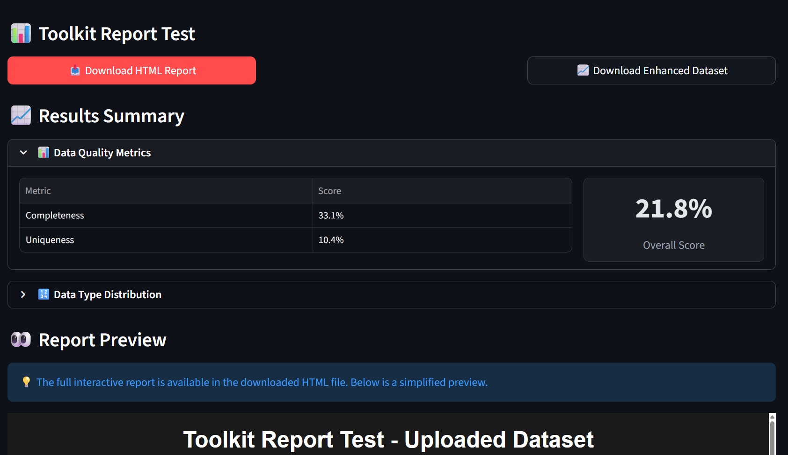

# 📊 Advancing UDQT — Unified Data Quality Toolkit

A Python + Streamlit toolkit for **data quality validation, reporting, and database performance demos**.  
It helps you **analyze datasets**, run **data quality checks**, and compare performance of **SQLite** and **DuckDB**.

---

## 🚀 Features

### Data Quality Toolkit
- ✅ **Validation Rules**:  
  - Not Null  
  - Unique Values  
  - Data Type / Range checks  
  - Allowed Sets & Regex patterns  
- 📊 **Visual Reports**: Interactive tables & metrics  
- 🏷 **Critical Columns**: Highlight key data elements  
- 📈 **Historical Tracking**: Monitor data quality across snapshots  
- 📤 **Export**: Save reports as CSV/HTML

### SQLite vs DuckDB Demo
- 🧪 **Small Demo**: Simple query comparison  
- 📊 **Big Data Demo**: Millions of rows to show performance differences  
- ☁️ **Blob Storage Context**: Explains S3/Azure Blob and DuckDB’s native integrations  

---

## 📂 Project Structure

```
Advancing UDQT/
│
├── bulk_tests/                       # CSV snapshots for quality testing
│
├── data_quality_checker.py           # Core validation engine
├── data_quality_streamlit_app.py     # Streamlit app for Data Quality Toolkit
├── database_streamlit_tests.py       # Streamlit app for SQLite vs DuckDB demo
├── data_quality_service_landing.html # HTML guide/landing page
│
├── requirements.txt                  # Dependencies
└── README.md                         # Project documentation
```

---

## ⚙️ Installation

1. Clone the repository:
```bash
git clone https://github.com/your-username/advancing-udqt.git
cd advancing-udqt
```

2. Create a virtual environment and install dependencies:
```bash
python -m venv venv
source venv/bin/activate   # (Windows: venv\Scripts\activate)
pip install -r requirements.txt
```

---

## ▶️ Usage

### Data Quality Toolkit
```bash
streamlit run data_quality_streamlit_app.py
```
Then open [http://localhost:8501](http://localhost:8501) in your browser.

### SQLite vs DuckDB Demo
```bash
streamlit run database_streamlit_tests.py
```
Explore demos comparing query speed on small & large datasets.

---

## 📊 Example Data
- `bulk_tests/` contains CSV snapshots to test validations over time.  
  Use these for **historical tracking** and **bulk quality checks**.

---

## 🛠 Requirements

Core dependencies:
```
streamlit>=1.25.0
pandas>=1.5.0
numpy>=1.23.0
duckdb>=0.9.0
```

---

## 📸 Screenshots

### Data Quality Toolkit


### SQLite vs DuckDB Demo


---

## 🤝 Contributing
1. Fork this repo  
2. Create a feature branch  
3. Submit a pull request  

---

## 📜 License
This project is open source under the **MIT License**.
